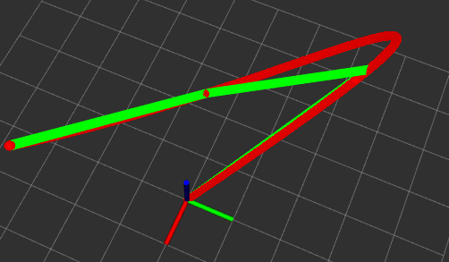
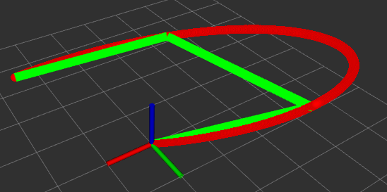
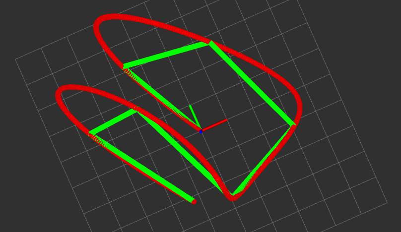
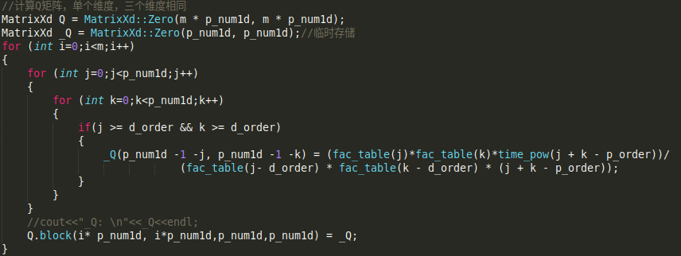
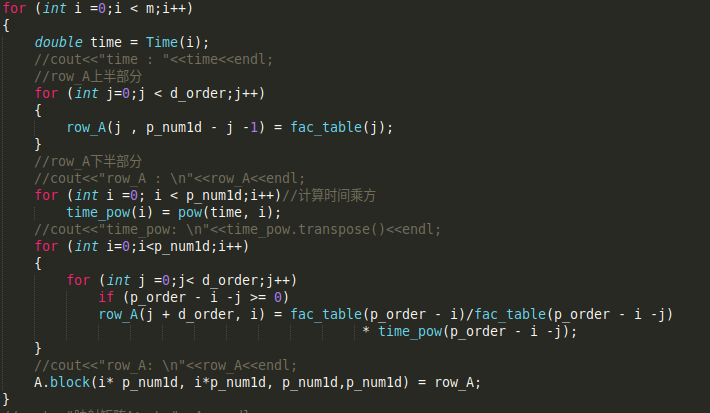
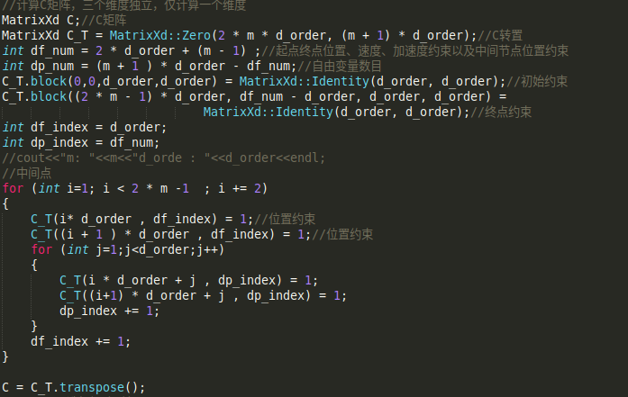

## 实验报告

### 一、 算法原理

OBVP问题回顾：

​	之前OBVP问题中，在给定初始点以及终止点时，求解出来的最优的轨迹为多项式轨迹。因此在本次实验中，以OBVP问题求解出来的结论为前提，进行多项式轨迹规划。

> 1. 给定初始点，中间路径点，以及终止位置，给定初始点，终止点速度，加速度约束
> 2. 优化变量，中间路径点速度与加速度
> 3. 计算minisnap目标优化函数，计算Q矩阵
> 4. 根据Time_durations以及多项式阶数,计算M矩阵
> 5. 为了将有线性约束的二次优化问题，转换为无约束的二次优化问题，利用C矩阵进行变量分离
> 6. 利用封闭式求解公式，计算最优解

### 二、 算法实现

本次实验主要包括四部分：

1. 时间分配，在测试时，采用了梯形速度平均方法分配时间以及每一段时间均为1，两种方式测试。效果如下：

   

   

       
       

           速度梯形时间_1
       

   

   

    
    

        速度梯形时间_2
    

    
    

        时间为1
    

从上图可以看出，在较长距离时，分配时间固定，规划的轨迹趋近于直线，在较短距离时，规划的曲线很陡峭，规划的轨迹不太美观。而梯形平均速度方法，稍好一点。

2. 求解Q矩阵

   

       
       

           Q矩阵
       

   

3. 求解M矩阵

   

       
       

           M矩阵
       

   

4. 求解C矩阵

   

       
       

           C矩阵
       

   
